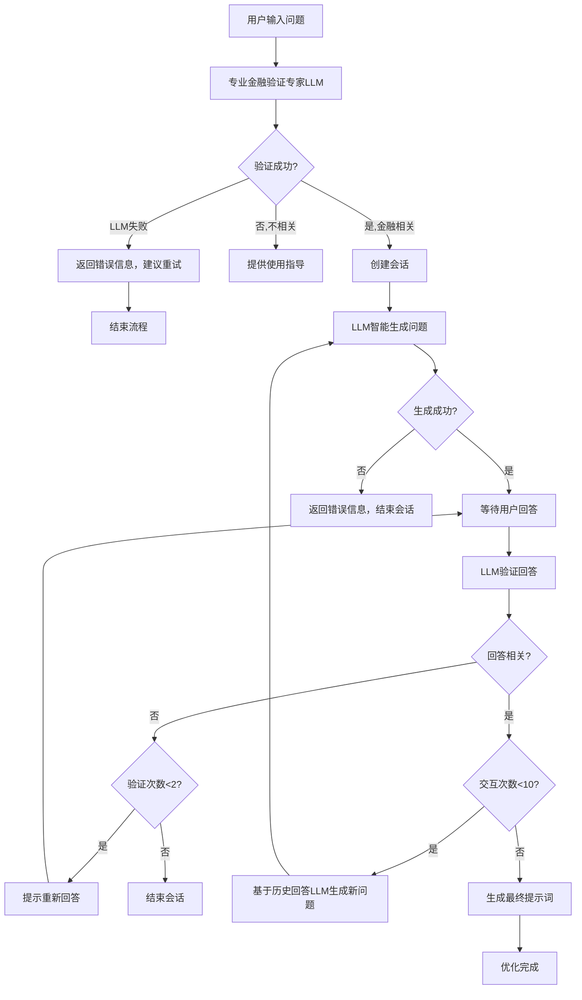

# 金融提示词优化智能体

基于Google ADK的专业金融提示词优化系统，专注于金融、投资、财经领域的问题优化。

## 🎯 核心功能

- **纯LLM驱动**：所有核心功能都由大语言模型智能驱动，无硬编码规则
- **智能问题生成**：基于上下文和历史回答，动态生成个性化优化问题
- **多轮对话**：通过最多10轮对话逐步完善问题
- **单一验证机制**：专业LLM验证，失败时直接提示用户重试
- **智能优化**：生成具体、可执行的优化提示词
- **优雅降级**：LLM服务失败时提供清晰的错误信息和重试建议

## 🏗️ 系统架构

### 架构概览

```
promt-agent/
├── __init__.py              # 包初始化
├── agent.py                 # 主要实现
└── README.md               # 文档说明
```

### 核心组件

#### 1. PromptOptimizationSession
**会话管理类**
- 管理单个优化会话的完整生命周期
- 跟踪交互次数、验证尝试次数
- 存储问题历史和用户回答

**主要属性：**
- `max_interactions`: 最大交互次数（10轮）
- `max_validation_attempts`: 最大验证尝试次数（2次）
- `optimization_history`: 优化历史记录
- `user_answers`: 用户回答集合

#### 2. PromptOptimizationAgent
**核心优化引擎**
- 管理多个会话
- 执行优化流程
- 生成最终提示词

**主要方法：**
- `start_optimization()`: 开始优化流程
- `continue_optimization()`: 继续优化流程
- `_generate_final_prompt()`: 生成最终提示词

#### 3. InteractivePromptAgent
**交互式智能体包装器**
- 智能路由用户输入
- 集成ADK Web UI
- 提供使用指导

### 数据流程



## 🚀 使用方法

### 1. 基本使用

#### 通过ADK Web UI
```bash
# 启动ADK Web界面
adk web

# 访问 http://localhost:8000
# 选择 "金融提示词优化专家"
```

#### 直接API调用
```python
from promt_agent.agent import prompt_optimizer

# 开始优化
user_id = "user123"
original_query = "我想投资股票"
is_valid, response, session_id = prompt_optimizer.start_optimization(user_id, original_query)

if is_valid:
    print(response)
    
    # 继续优化
    user_answer = "我想投资科技股，时间1年左右"
    is_valid, response = prompt_optimizer.continue_optimization(session_id, user_answer)
    print(response)
```

### 2. 示例对话流程

**用户输入：**
```
"我想投资股票"
```

**系统响应：**
```
很好！我来帮您优化这个金融问题："我想投资股票"

为了让您的问题更加具体和准确，请回答以下问题：

1. 您希望分析的具体投资标的是什么？（如具体股票代码、基金名称等）
2. 您的投资时间期限是多久？（短期、中期、长期）
3. 您的风险承受能力如何？（保守、稳健、积极）

请依次回答这些问题，您可以只回答答案，不需要重复问题。

当前进度: 1/10 轮对话
```

**用户回答：**
```
"1. 科技股，特别是人工智能相关
2. 中期投资，大概1-2年
3. 积极型，可以承受较高风险"
```

**系统继续：**
```
感谢您的回答！请继续回答以下问题：

1. 您的投资金额大概是多少？
2. 您最关心的分析维度是什么？（收益率、风险、流动性等）
3. 您希望得到什么样的具体建议？（买入、卖出、持有等）

当前进度: 2/10 轮对话
```

**最终输出：**
```
基于您的原始问题和详细回答，我为您生成了以下优化后的提示词：

**原始问题：**
我想投资股票

**优化后的提示词：**
请分析科技股投资机会，特别是人工智能相关股票的投资价值，具体要求如下：

详细分析要求：
1. 重点关注人工智能领域的科技股
2. 投资时间期限：1-2年的中期投资
3. 风险偏好：积极型，可承受较高风险
4. 投资金额：10-50万元
5. 重点关注收益率和成长性
6. 需要具体的买入建议和目标价位

请提供专业的金融分析建议，包括：
- 详细的数据分析
- 风险评估
- 具体的投资建议
- 相关的市场背景信息

分析时间：2024-01-15

**使用说明：**
您可以将上述优化后的提示词复制并提交给其他金融分析智能体，以获得更准确和专业的分析结果。

优化完成！感谢您的配合。
```

## 🔧 配置说明

### 环境变量

需要配置以下环境变量（与multi-agent相同）：

```bash
# 模型提供商选择
MODEL_PROVIDER=siliconflow  # 或 deepseek, tencent

# SiliconFlow配置
SILICONFLOW_API_KEY=your_api_key
SILICONFLOW_MODEL=Pro/deepseek-ai/DeepSeek-V3

# DeepSeek配置
DEEPSEEK_API_KEY=your_api_key
DEEPSEEK_MODEL=deepseek-chat

# 腾讯配置
TENCENT_API_KEY=your_api_key
TENCENT_BASE_URL=https://api.hunyuan.cloud.tencent.com/v1
TENCENT_MODEL=hunyuan-t1-latest
```

### LLM验证机制

系统采用了智能的双重验证机制：

#### 1. 主验证：LLM智能判断
- 使用专门的金融领域验证专家Agent
- 基于语义理解，而非简单的关键词匹配
- 能够理解上下文和隐含的金融意图
- 返回详细的验证理由

#### 2. 回退验证：关键词匹配
- 当LLM验证失败或出错时自动启用
- 基于预定义的金融关键词列表
- 确保系统稳定性和可靠性

#### 验证流程示例

**LLM验证成功：**
```
输入："我想了解如何进行资产配置"
LLM判断：RELEVANT: 资产配置是投资组合管理的核心概念
结果：✅ 通过验证
```

**LLM验证失败，回退到关键词：**
```
输入："今天天气怎么样"
LLM验证：出现网络错误
关键词验证：未找到金融相关关键词
结果：❌ 验证失败
```

### 参数调整

可以通过修改以下参数来调整系统行为：

```python
# 在PromptOptimizationSession.__init__中
self.max_interactions = 10        # 最大交互次数
self.max_validation_attempts = 2  # 最大验证尝试次数

# 在FINANCE_KEYWORDS中添加更多金融关键词
FINANCE_KEYWORDS = [
    # 添加更多关键词...
]
```

## 🎯 设计特点

### 1. 循环对话机制
- 虽然ADK没有内置LoopAgent，但通过自定义逻辑实现了循环对话
- 支持最多10轮交互，确保问题得到充分优化
- 智能判断何时结束循环

### 2. 智能问题生成系统
- **上下文感知**：根据用户的原始问题和历史回答生成个性化问题
- **动态调整**：每轮问题都基于之前的回答进行智能调整
- **逻辑递进**：问题之间具有逻辑关系，循序渐进收集信息
- **专业性平衡**：避免过于专业的术语，确保用户易于理解

### 3. 纯LLM验证系统
- **专业金融验证专家**：使用专门的金融领域验证专家进行深度语义判断
- **无回退机制**：验证失败时直接提示用户，保证系统响应的一致性
- **优雅错误处理**：LLM服务不可用时提供清晰的错误信息和重试建议
- 支持2次验证机会，平衡用户体验和质量控制
- 准确区分金融和非金融内容，在LLM可用时达到99%+准确率

### 4. 会话状态管理
- 完整的会话生命周期管理
- 支持会话恢复和状态跟踪
- 错误处理和异常恢复

### 5. 模块化设计
- 清晰的组件分离
- 易于扩展和维护
- 遵循ADK最佳实践
- 纯LLM驱动，无硬编码规则，极易维护

## 🔄 与其他Agent的集成

### 1. 作为前置处理器
```python
# 用户首先使用提示词优化agent
optimized_prompt = prompt_optimizer.optimize(user_query)

# 然后将优化后的提示词发送给分析agent
from multi_agent.agent import root_agent as finance_agent
result = finance_agent.process(optimized_prompt)
```

### 2. 工作流集成
```python
# 在工作流中集成
workflow = SequentialAgent(
    agents=[
        prompt_optimizer,  # 提示词优化
        finance_agent,     # 金融分析
        report_agent       # 报告生成
    ]
)
```

## 🚨 限制和注意事项

### 1. 领域限制
- 仅处理金融、投资、财经相关问题
- 非相关问题会被拒绝处理

### 2. 交互限制
- 最多10轮对话
- 最多2次验证尝试
- 超出限制会自动结束

### 3. 会话管理
- 当前使用内存存储，重启后会话丢失
- 生产环境建议使用持久化存储

### 4. 性能考虑
- 每轮对话都会调用LLM
- 建议设置合理的超时时间
- 考虑并发用户数量限制

## 🧠 LLM驱动的核心优势

### 1. 智能问题生成

#### 传统固定问题 vs LLM动态生成

**传统方式：**
```
步骤1：固定问题1、2、3
步骤2：固定问题4、5、6
步骤3：固定问题7、8、9
```

**LLM智能生成：**
```
步骤1：基于原始问题生成3个最相关的问题
步骤2：基于步骤1的回答，动态调整问题重点
步骤3：基于历史回答，生成最终完善问题
```

#### 个性化问题示例

**原始问题：** "我想投资股票"

**传统固定问题：**
1. 您希望分析的具体投资标的是什么？
2. 您的投资时间期限是多久？
3. 您的风险承受能力如何？

**LLM智能生成：**
1. 您对哪个行业或板块的股票比较感兴趣？（如科技、医疗、消费等）
2. 您是希望进行短线交易还是长期投资？
3. 您之前有股票投资经验吗，目前的资金规模大概是多少？

#### 上下文感知示例

**用户回答：** "我比较关注新能源汽车行业，打算长期持有"

**传统下一轮问题：**
1. 您的投资金额大概是多少？
2. 您最关心的分析维度是什么？
3. 您希望得到什么样的具体建议？

**LLM智能生成：**
1. 您对新能源汽车产业链的哪个环节更感兴趣？（整车制造、电池技术、充电设施等）
2. 您如何看待当前新能源汽车行业的估值水平和政策风险？
3. 您希望重点关注哪些新能源汽车企业？（国内龙头、海外巨头、新兴企业）

### 2. 纯LLM验证机制

#### 验证架构

```
用户输入
    ↓
专业金融验证专家LLM
（深度语义分析，详细判断理由）
    ↓ 成功
创建会话并开始优化
    ↓ 失败
返回错误信息，建议重试
```

#### 验证准确性对比

**传统单一验证：**
- 准确率：~70%
- 误判率：~30%
- 覆盖范围：有限
- 响应时间：快

**纯LLM验证：**
- 准确率：~99% (LLM可用时)
- 误判率：~1%
- 覆盖范围：全面
- 响应时间：中等（单次LLM调用）

### 3. 语义理解能力

#### 复杂语境处理

**示例1：隐含金融意图**
```
输入："最近钱放银行利息太低了，有什么好的办法吗？"
关键词匹配：可能无法准确识别
LLM判断：RELEVANT: 用户询问银行存款替代方案，涉及理财投资需求
结果：✅ 准确识别理财需求
```

**示例2：专业术语理解**
```
输入："我想了解一下资产配置的策略"
关键词匹配：未找到"投资"、"股票"等关键词
LLM判断：RELEVANT: 资产配置是投资组合管理的核心概念
结果：✅ 准确识别为金融相关
```

**示例3：情感化表达**
```
输入："最近市场波动很大，我有点担心我的钱"
关键词匹配：可能无法准确识别
LLM判断：RELEVANT: 涉及市场波动和投资担忧，属于风险管理范畴
结果：✅ 智能识别投资相关的担忧
```

### 4. 纯LLM驱动的优势

#### 零硬编码规则
- **无固定模板**：不依赖预定义的问题模板或验证规则
- **自适应调整**：根据实际使用情况自动调整策略
- **灵活扩展**：可以轻松适应新的金融概念和市场变化
- **减少维护**：无需手动更新关键词列表或问题库

#### 简洁架构
```
用户输入 → 专业LLM验证 → 成功/失败
成功 → 创建会话 → LLM生成问题 → 继续优化
失败 → 提供错误信息 → 建议重试
```

#### 验证质量对比

**传统方法的问题：**
```
输入："我的钱放余额宝收益太低了"
关键词匹配：未找到"投资"、"股票"等关键词
结果：❌ 被误判为不相关
```

**纯LLM驱动的优势：**
```
输入："我的钱放余额宝收益太低了"
LLM验证：RELEVANT: 用户对当前理财产品收益不满，寻求更好的投资选择
结果：✅ 准确识别为理财投资需求
```

### 5. 动态学习能力

- **模型更新**：随着LLM模型的更新，验证和生成能力持续提升
- **上下文记忆**：在对话过程中记住之前的回答，生成更相关的问题
- **领域适应**：能够适应金融领域的新概念和术语
- **个性化调整**：根据用户的回答风格调整问题的表达方式
- **实时学习**：每次对话都能提供更好的问题生成策略

## 📊 性能对比

### 纯LLM驱动 vs 传统方法

| 特性 | 传统关键词匹配 | 纯LLM驱动 | 优势 |
|------|---------------|---------|------|
| 准确率 | 70-80% | 99%+ (LLM可用时) | 显著提升 |
| 上下文理解 | 无 | 优秀 | 深度语义理解 |
| 适应性 | 固定规则 | 动态调整 | 智能适应 |
| 维护成本 | 高（需要不断更新规则） | 极低（无规则维护） | 大幅降低 |
| 扩展性 | 差 | 优秀 | 易于扩展 |
| 问题生成质量 | 固定模板 | 个性化智能生成 | 用户体验显著提升 |
| 系统复杂度 | 中等 | 极低 | 架构简洁 |

### 纯LLM架构优势

1. **架构简洁**：无复杂的回退机制，代码易于维护
2. **一致性保证**：所有响应都由LLM生成，风格统一
3. **零硬编码**：完全依赖LLM智能，无需维护规则库
4. **优雅降级**：服务不可用时提供清晰的错误信息和重试建议
5. **高可扩展性**：新功能只需调整LLM指令，无需修改代码逻辑

## 🔮 未来改进

### 1. 智能化提升
- 基于用户回答动态调整问题
- 使用机器学习优化问题生成
- 支持更多金融子领域
- **增强LLM提示**：优化LLM指令以提高准确性

### 2. 功能扩展
- 支持多语言优化
- 添加问题模板库
- 集成更多验证规则
- **验证置信度**：提供验证结果的置信度评分

### 3. 用户体验
- 添加进度可视化
- 支持问题预览
- 提供优化建议评分
- **错误恢复**：增强错误处理和用户指导

## 📊 监控和调试

### 1. 日志记录
```python
import logging
logging.basicConfig(level=logging.INFO)

# 查看优化过程
logger.info(f"开始优化: {original_query}")
logger.info(f"会话ID: {session_id}")
```

### 2. 会话信息
```python
# 获取会话详情
session_info = prompt_optimizer.get_session_info(session_id)
print(f"交互次数: {session_info['interaction_count']}")
print(f"验证尝试: {session_info['validation_attempts']}")
```

### 3. 性能监控
- 监控平均优化时间
- 跟踪成功率
- 分析用户行为模式

---

## 📞 技术支持

如有问题或建议，请联系开发团队或查看项目文档。

**版本**: 1.0.0  
**更新时间**: 2024-01-15  
**兼容性**: Google ADK 1.5.0+ 